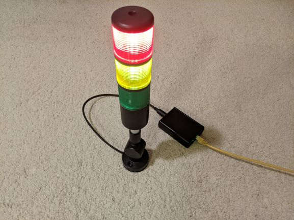

POE Stack Light PCB design
==========================

The [POE stack light][blog-post] is a network controlled status indication light that is powered over the network using POE.

This repository contains the Kicad schematic and PCB design for the project, the [firmware][firmware-repo] and [documentation and build guide][documentation-repo] can be found in their respective git repositories.

Circuit Overview
---------------

The design is split into four major sections, the output stage, the POE power supply, the processor, and the network interface.

The stack light takes a common 12v input with switched grounds for each light segment and the buzzer.
A mosfet is used to control each of the channels, brightness is controlled by PWM from the microcontroller.
As supplied the light has a voltage regulator based current limiter shared across all the illumination channels, this prevents multiple segments from being lit at full brightness simultaneously.
This is resolved by bypassing the current limit inside the light with a jumper wire and then adding a copy of the current limiter circuit in the light to the board for each of the three led channels, giving them their own current limit.
See the assembly documentation for how to modify the stack light do this.

For the POE power input, a transformer setup rather than a switch mode design is used.
The use of a transformer based design provides electrical isolation and allows other connections to be exposed without the risk of a short.
The power over ethernet schematic is based on the MP8007 reference design.
A backup DC jack is also available if wanting to build without POE.

An integrated ESP32 wireless module is used for the main processor.
The network interface uses the LAN8710A ethernet transceiver IC.
This communicates to the ESP32 with the RMII protocol used for 100MB ethernet PHYs.
A USB to serial converter is included to facilitate easy programming.

[blog-post]: https://www.scorpia.co.uk/2021/05/23/building-a-poe-enabled-lighting-fixture/
[firmware-repo]: https://github.com/Tyler-Ward/stacklight-firmware
[documentation-repo]: https://github.com/Tyler-Ward/stacklight-documentation
